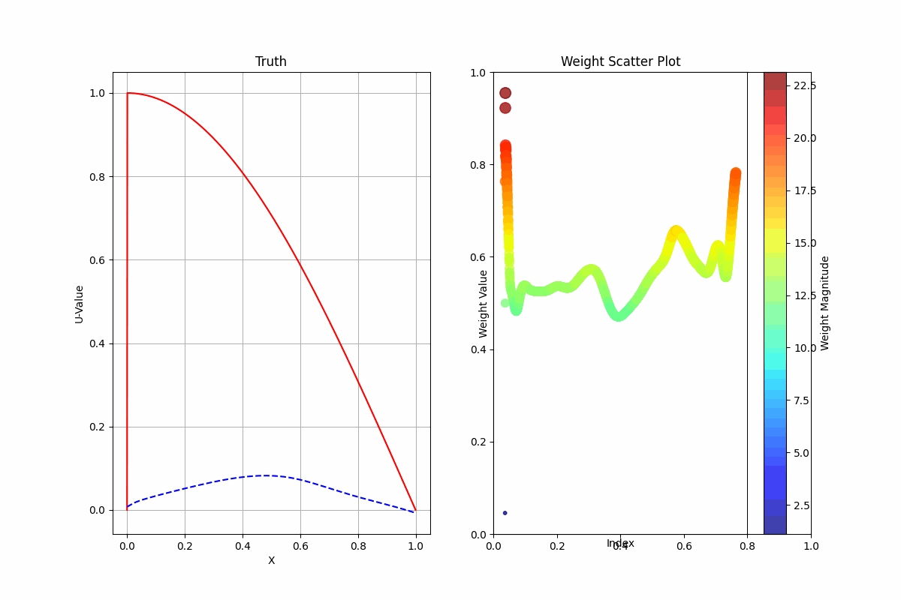

# PINN-Alternating-Easy-Hard
This repository contains the implementation of our paper:

**Consistent PINN Accuracy via Alternating Easy-Hard Training**

📄 Paper: Consistent PINN Accuracy via Alternating Easy-Hard Training

## 📌 Overview
We propose a new training strategy for Physics-Informed Neural Networks (PINNs) that alternates between easy and hard samples during training to improve accuracy and stability.

## 🚀 Getting Started
```bash
pip install -r requirements.txt
python main.py
```

# 1D-CDD(eps=1e-6)
- The animation provides a visual demonstration of the model's progression through various training phases.
<p align="center">
  
</p>
