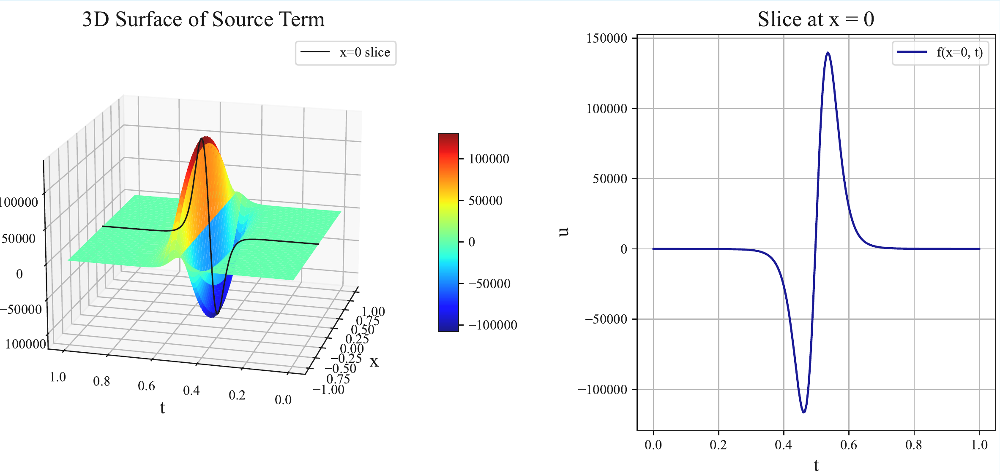
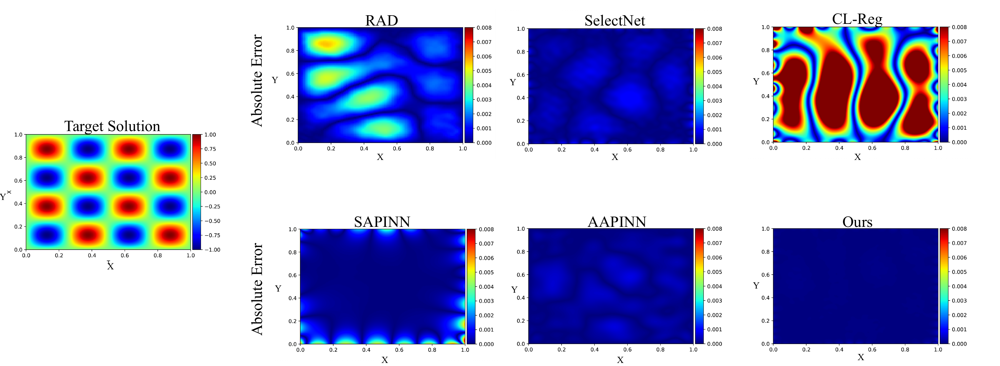
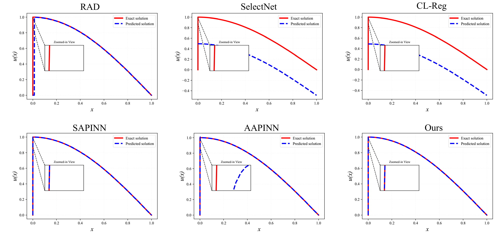
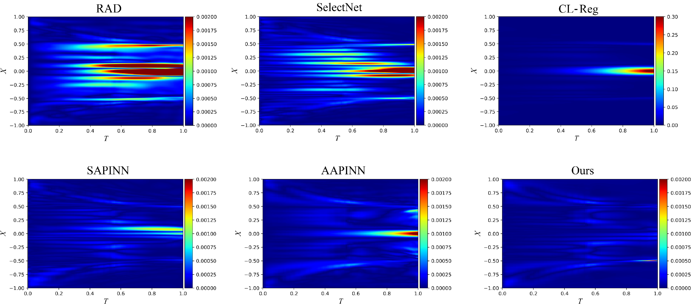
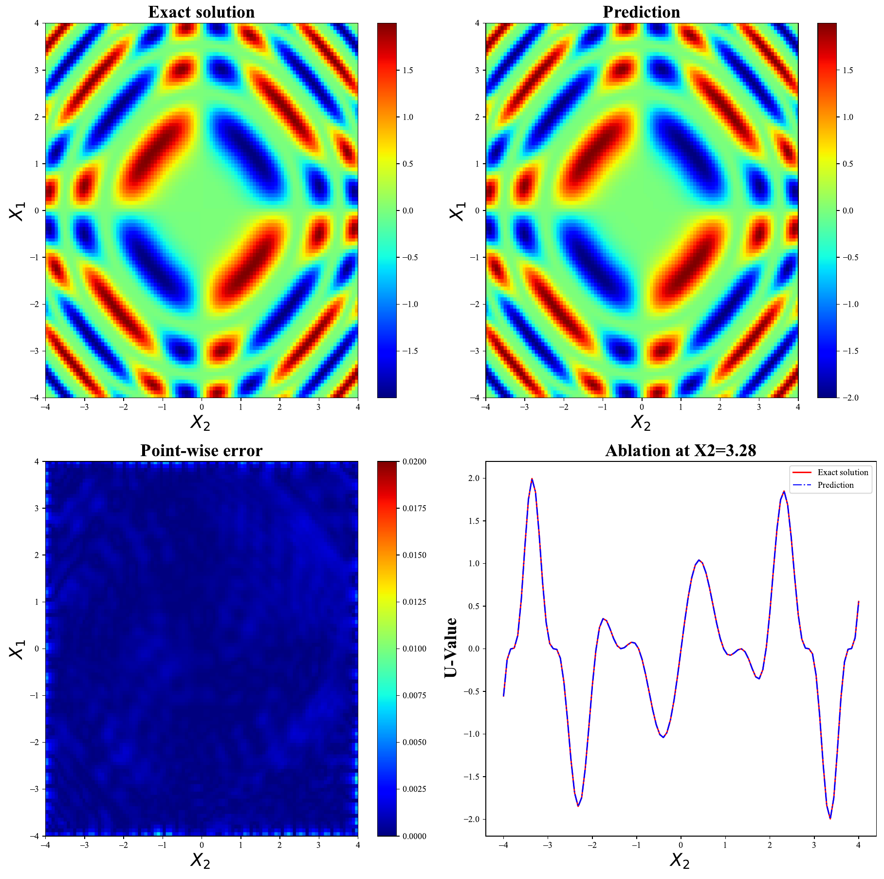
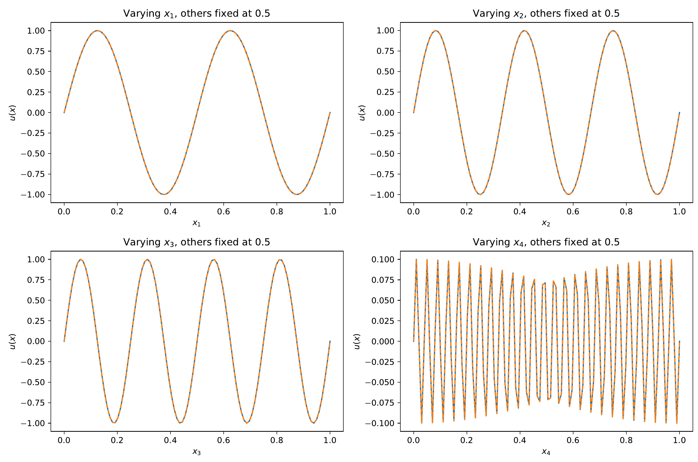

# PINN-Alternating-Easy-Hard
This repository contains the implementation of our paper:

**More Consistent PINN Accuracy via Alternating Easy-Hard Training**

📄 Paper: More Consistent PINN Accuracy via Alternating Easy-Hard Training

## 📌 Overview
Physics-informed neural networks (PINNs) have recently emerged as a prominent paradigm for solving partial differential equations (PDEs), yet their training strategies remain underexplored. While hard prioritization methods inspired by finite element methods are widely adopted, recent research suggests that easy prioritization can also be effective. Nevertheless, we find that both approaches exhibit notable trade-offs and inconsistent performance across PDE types. To address this issue, we develop a hybrid strategy that combines the strengths of hard and easy prioritization through an alternating training algorithm. On PDEs with steep gradients, nonlinearity, and high dimensionality, the proposed method achieves consistently high accuracy, with relative $L^2$ errors mostly in the range of $\mathcal{O}(10^{-5})$ to $\mathcal{O}(10^{-6})$, significantly surpassing baseline methods. Moreover, it offers greater reliability across diverse problems, whereas compared approaches often suffer from variable accuracy depending on the PDE. This work provides new insights into designing hybrid training strategies to enhance the performance and robustness of PINNs. 

## 🚀 Getting Started

```bash
pip install -r requirements.txt
cd ./[Your target foler]
python main.py
```

# Heat (Steep gradient)
- Visualization of a source term at $ \alpha=0.11 $ used in the heat conduction equation.
- **Left:** 3D surface of the source term $f(x,t)$, exhibiting sharp localized peaks and steep gradients, with value ranges exceeding $10^5$.
- **Right:** 1D slice of $f(x,t)$ along $x = 0$, showing highly nontrivial temporal behavior.
- Such source terms introduce strong local features and multiscale variations in the solution, posing significant challenges for standard PINNs to learn effectively.
<div align="center">

</div>


# Helmholtz
- Visualization of a source term at $ \alpha=0.11 $ used in the Helmholtz equation.
<div align="center">

</div>


# 1D-CDD(eps=1e-6)

- Visualization of predicted solutions by various methods for the convection-dominated equation
<div align="center">

</div>

- The animation provides a visual demonstration of the model's progression through various training phases.
<p align="center">
  
</p>

# Allen-Cahn

- Visualization of point-wise by various methods for the Allen-Cahn equation
<div align="center">

</div>


# Sine-Gordon

- Visualization of  predicted solutions by AEH-PINN for the Sine-Gordon equation
<div align="center">

</div>

# 4D Multiscale

- Visualization of predicted solutions at each dimensional by AEH-PINN for the 4D Multiscale equation
<div align="center">

</div>

